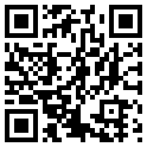

jQuery nomouse
================

A lightweight plugin which translates mouse into touch events. Because [thats how it's supposed to be](http://blog.nighttime.ro/?p=164).

Instead of mapping a touch event to a mouse one, this plugin does the opposite and fires a simulated touch event for every mouse action. The click event isn't simulated.

Advantages are
--------------
* Lightweight
* Native support
* Very fast

Known bugs
----------
* Android issue [#19827](http://code.google.com/p/android/issues/detail?id=19827)

Examples
--------

[__Multiple bindings here__](http://blog.nighttime.ro/?p=164#source)

Please contribute to make this the standard approach when doing websites.

Tested in IE7/8, Firefox 20, Opera, Safari, Chrome and in Android 4.0.1